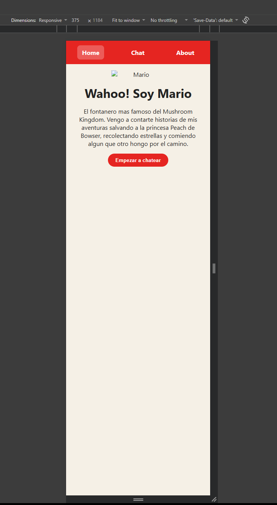
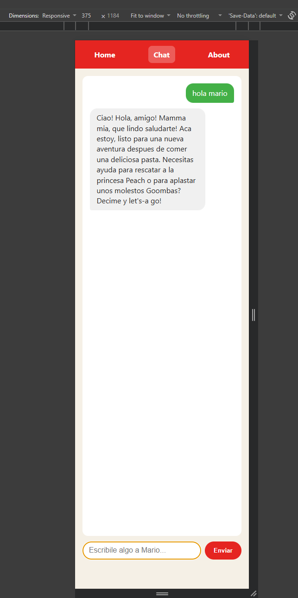
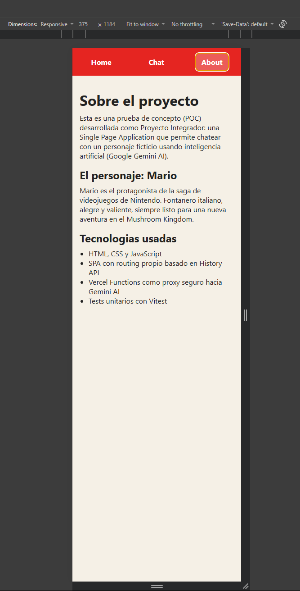
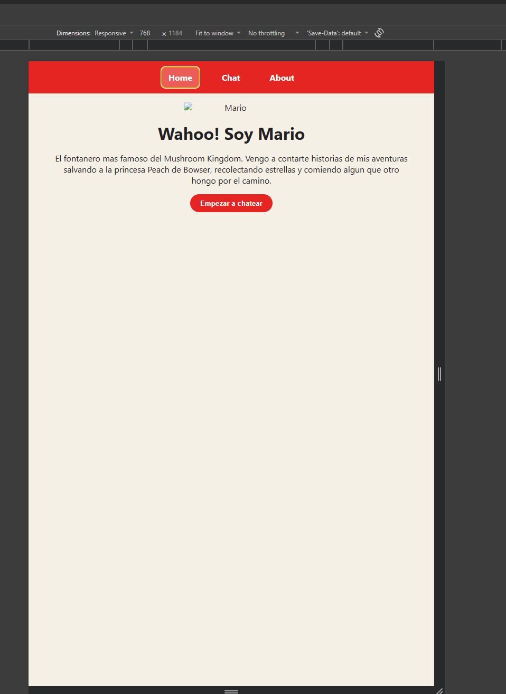
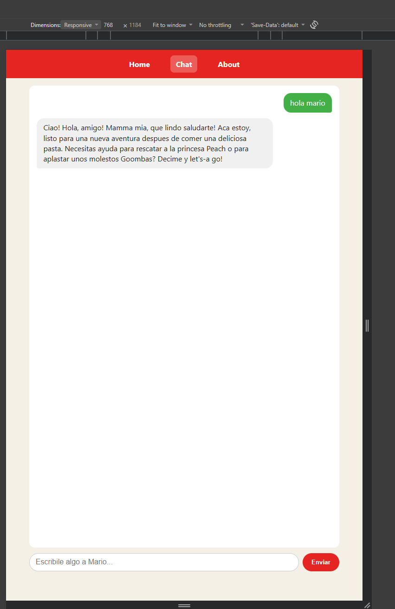
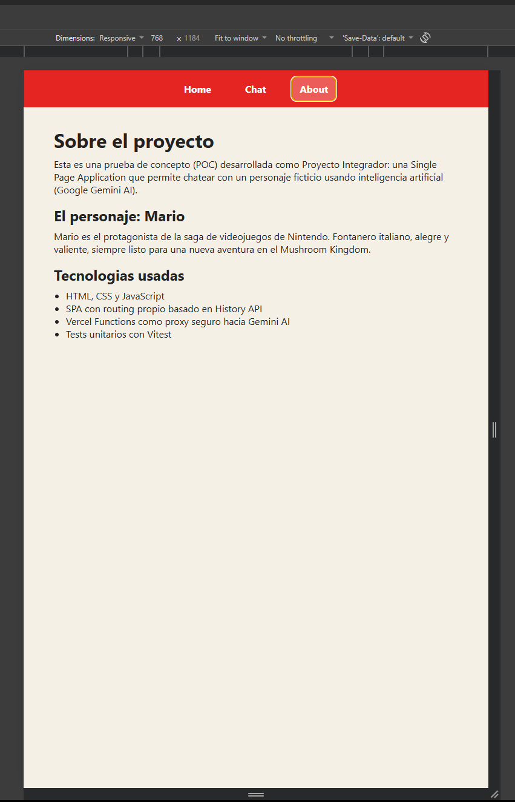
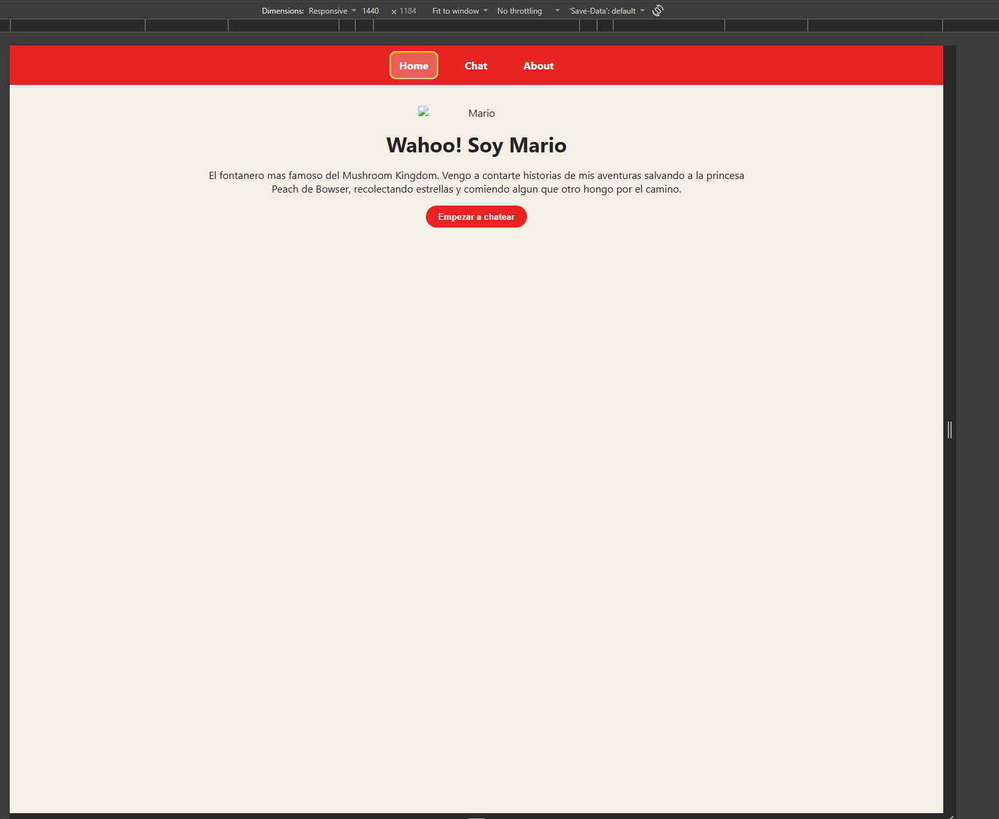
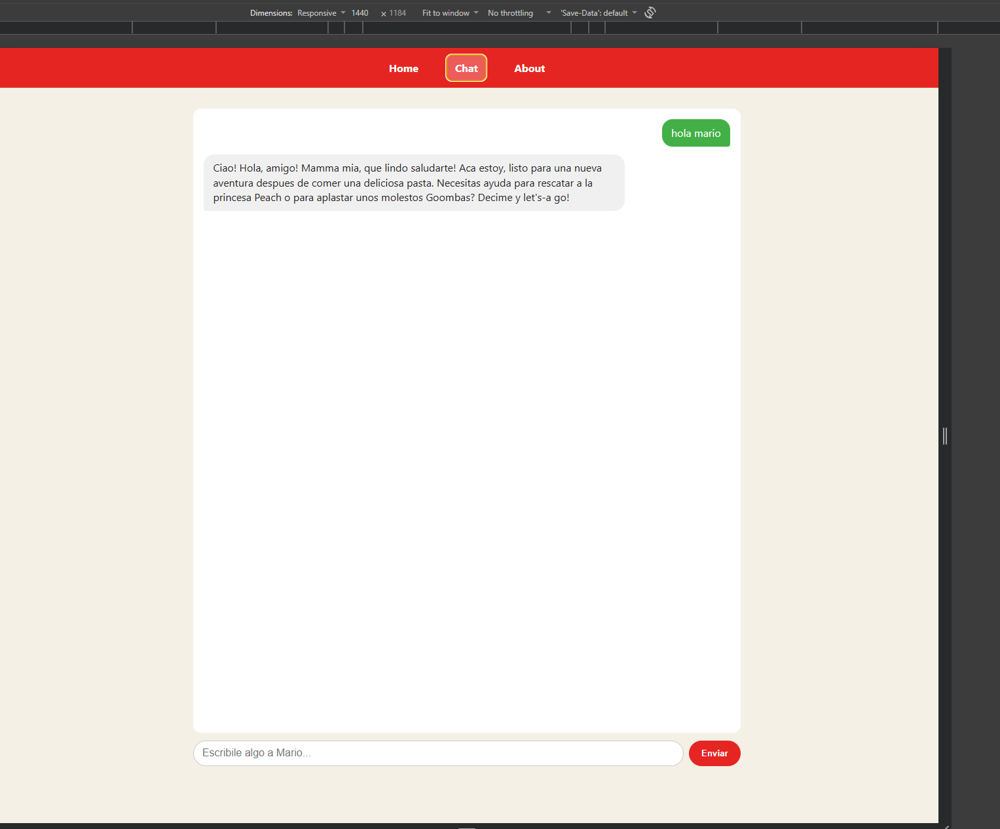
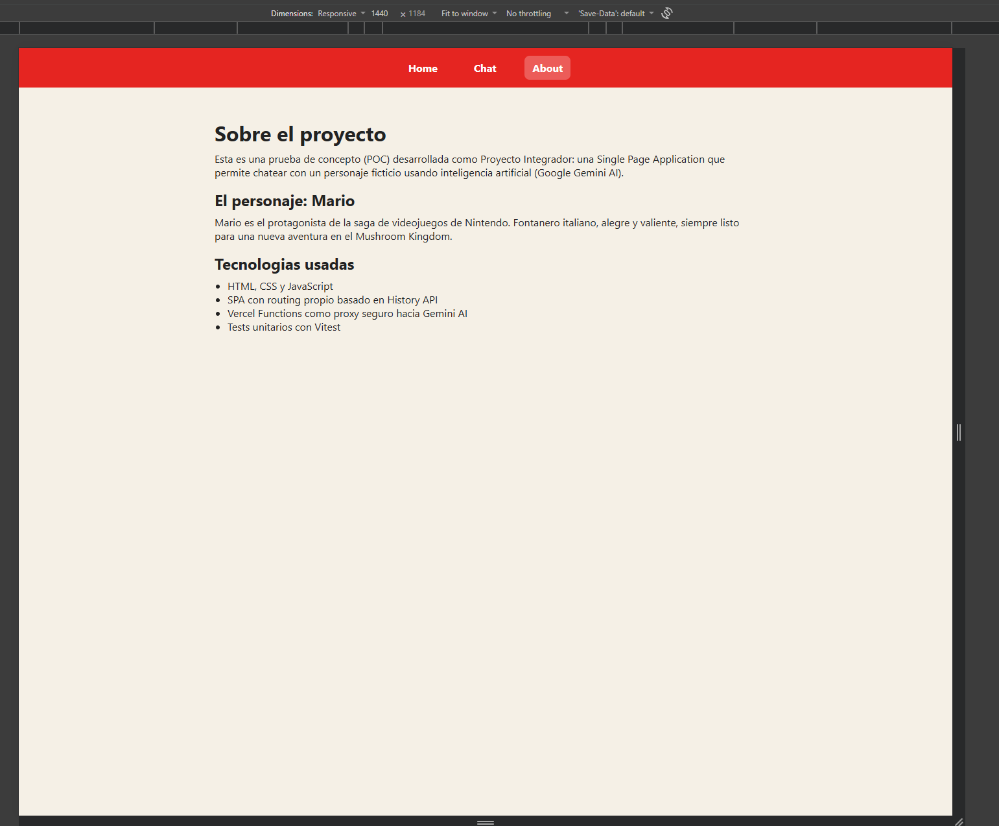

# Chatea con Mario 🍄

SPA que permite chatear con Mario (personaje de Nintendo) usando Google Gemini AI.
Proyecto Integrador — POC para ComicSansCon.

## Personaje elegido: Mario

Mario es el fontanero protagonista de la saga de videojuegos de Nintendo. Es
alegre, optimista y siempre esta en alguna aventura salvando a la princesa
Peach de Bowser. El system prompt lo hace hablar con acento ítalo-neoyorquino
característico ("Mamma mia!", "Let's-a go!", "Wahoo!"), en frases cortas y
con buena onda, ideal para el formato chat.

## Estructura del proyecto

├── api/
│   └── functions.js     
├── src/
│   ├── index.html
│   ├── styles.css
│   ├── app.js            
│   ├── chat.js            
│   └── utils.js            
├── tests/
│   ├── utils.test.js
│   ├── app.test.js
│   └── chat.test.js
├── .env.example
├── .gitignore
├── vercel.json
└── package.json
└── vitest.config.js

## Requisitos y pasos para ejecutar en local

1. Instalar dependencias:

   npm install

2. Copiar `.env.example` a `.env.local` y completar con tu API key de Gemini
   (se obtiene gratis en https://aistudio.google.com/apikey):
 
   GEMINI_API_KEY=tu_api_key_aca

3. Instalar Vercel CLI (si no la tenes):

   npm i -g vercel

4. Levantar el proyecto con `vercel --prod` para probar en un entorno real,
   o intentar `vercel dev` para desarrollo local. **Nota:** en mi caso de 
   desarrollo (Windows), `vercel dev` tuvo conflictos con la deteccion
   automática de framework (Vite) y con permisos de puerto; termine
   iterando directo contra despliegues de producción (`vercel --prod`) en
   vez de depender del servidor de desarrollo local.  Si `vercel dev` te funciona sin problemas, es la opcion mas comoda porque
   corre el front y la serverless function juntos sin necesidad de
   desplegar cada vez.

## Cómo correr los tests

npm run test

Corre los tests con Vitest (entorno jsdom): `utils.test.js` (funciones puras),
`chat.test.js` (fetch hacia la API, mockeado) y `app.test.js` (router).

## Cómo desplegar a Vercel

1. Subir el repo a GitHub (opcional para el deploy en si, pero recomendado
   para conectar despliegues automaticos).
2. Crear el proyecto en Vercel (por CLI con `vercel` o importando el repo
   desde [vercel.com](https://vercel.com/new)).
3. En **Project Settings -> Build and Deployment -> Framework Preset**,
   asegurarse de que esté en **"Other"** (no "Vite") y sin "Development
   Command" forzado — el proyecto es JS vanilla sin paso de build.
4. En **Project Settings -> Environments -> Production -> Environment
   Variables**, agregar `GEMINI_API_KEY` con el valor real.
5. Desplegar con `vercel --prod` y verificar:
   - Que `/`, `/chat` y `/about` funcionen (incluso refrescando cada ruta).
   - Que el chat responda correctamente y muestre errores si la API falla.
   - Si algo falla, revisar los logs con `vercel logs <url-del-deploy>` o
     desde el dashboard (pestaña Logs del proyecto).

## Capturas de pantalla

Capturas de pantalla (mobile - tabley - desktop) estaran en otra carpeta.
**Mobile (375px):**
Home:

Chat:

About:

**Tablet (768px):**

Home:

Chat:

About:

**Desktop (1440px):**

Home:

Chat:

About:

## Link a la aplicación desplegada

**https://chatea-con-mario.vercel.app**

## Registro del uso de AI

En este proyecto nuevamente use Claude porque como mencione es el mejor por el momento y el que mejor supo recibir mis prompts. En este caso lo use mayormente por alguno errores e incovenientes que tuve con vercel y los frameworks. Tambien con ayuda de algunos videos en youtube que busque o el mismo me recomendo.
- Preguntar sobre los tests con Vitest.
- Diagnosticar y resolver problemas de configuración de Vercel (detección
  automática de framework Vite, scripts de `package.json` que interferian
  con `vercel dev`/`vercel --prod`, permisos de puerto en Windows).
- Diagnosticar el error 404 del modelo `gemini-2.0-flash` (discontinuado) y
  migrar a `gemini-3.6-flash` y tambien la desactivacion del "thinking mode"
  (`thinkingConfig.thinkingBudget: 0`) que filtraba texto de razonamiento
  interno en las respuestas del personaje.
- Limpiar el formato Markdown (asteriscos) que devolvia el modelo, tanto en
  el system prompt como con una función de respaldo (`stripMarkdown`) para algo mas "lindo" de ver.

Todo el codigo fue revisado y probado en el despliegue de produccion antes
de la entrega.

## Notas técnicas

- El historial de conversación vive en memoria (`chat.js`) y se pierde al
  recargar.
- La API key nunca se expone en el cliente: todo pasa por `api/functions.js`.